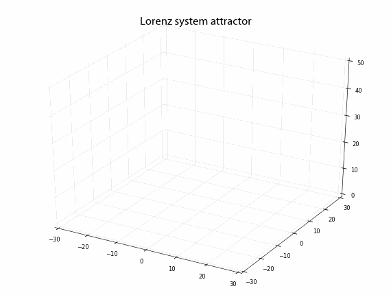

---

marp: true
theme: academic
paginate: false
style: |
  .container {
    display: flex;
    width: 100%;
    height: 100%;
    justify-content: space-between;
    align-items: center;
    gap: 100px;
  }
  .column {
    flex: 1;
    padding: 0 10px;
  }
  img[alt~="center"] {
    display: block;
    margin: 0 auto;
  }
  svg[id^="mermaid-"] { 
    min-width: 550px; 
    max-width: 960px; 
    min-height: 400px; 
    max-height: 500px;
  }

---
<!-- _class: lead -->

<!--  -->
<!--  -->

<h1 style="color: white;"> GENERATING MUSIC VARIATIONS </h1>

through Chaotic Dynamical Systems Exploration

 

  

Wannasa Rianthong  
Kanatsanun Sub-udom   
Patipan Somwong

 

<!-- **17 January 2025** -->

---
<!-- header: Overview -->

  

We aim to develop a tool for generating musical melodies through chaotic dynamical system.

  

    <h3>Original</h3>
      
      <audio controls>
        <source src="mp3/Ah_je_vous_dirai_maman_theme.wav">
      Your browser does not support the audio element.
      </audio>
       
       
      <h3>Variation</h3>
      
      <audio controls>
        <source src="mp3/Ah_je_vous_dirai_maman_Var_1.wav">
      Your browser does not support the audio element.
      </audio>
  

---
<!-- header: Objectives -->

1. Develop an alternative algorithm that uses fewer resources for generating music through a chaotic dynamical system.
2. Demonstrate that chaotic dynamical systems can be applied to create new music based on existing compositions.
3. Provide composers with limited resources and tools the opportunity to utilize the algorithm as a source of inspiration for further songwriting.

---
<!-- header: Limitations of the Study -->

1. Only focus on expended rhythm and melodic techniques.
2. Only based on dynamical systems and music theory.
3. Outputs are not ready to use. Require expert's revisions.

---
<!-- header: Methodology -->

1. Develop techniques for setting standards and selecting chaotic systems that generate musically interesting sequences.

---

<!-- header: Methodology -->

2. Compose a new music variation technique using the chaotic mapping for generating music variations.
3. Create a software package or tool that can automatically generate musical variations.

---

<!-- header: Study Duration -->

---
<!-- header: Estimated Results -->

1. An algorithm for creating new music a template.
2. A web application for generating musical melodies.
3. A Python software library for generating musical variations.

---
<!-- header: Tools & Softwares -->

---

<!-- header: Backup -->

---

##### .

---

##### .

---
<h1>Dynamical System</h1>

  

  <h3>Discreate</h3>

  $$
  x_{n + 1} = f(x_n)
  $$
  Where $f:\mathbb{R}^m \to \mathbb{R}^m$, $x_n \in \mathbb{R}^m$ is the state at time $n$ and $n \in \mathbb{N}.$   
  

  

  <h3>Continuous</h3>

  $$
  x^\prime(t) = f(x(t))
  $$
  Where $f:\mathbb{R}^n \to \mathbb{R}^n$, $x(t) \in \mathbb{R}^n$ is the state at time $t$ and $t \in [0, \infty).$ 
  

---

## Chaotic System

- Aperiodic long-term behavior

- Deterministic

- Sensitive dependence on initial conditions

---

## Lorenz Equation

$$ 
\begin{aligned}
\dot{x}_1 &= \sigma(x_2 - x_1) \\
\dot{x}_2 &= rx_1 - x_2 - x_1x_3 \\
\dot{x}_3 &= x_1x_2 - bx_3
\end{aligned}
$$
Where parameters $\sigma > 0$, $r > 0$ and $b > 0$. If parameters set to $\sigma = 10$, $r = 28$ and $b = \dfrac{8}{3}$, it exhibits chaotic behavior.

---

## Lorenz Equation 

---

## Numerical Solution

  

  <h4>Euler's Method</h4>

  $$
  y_{n+1} = y_n + h \cdot f(x_n, y_n)
  $$
  Where $n = 0,1,2, \ldots$.  
  

  

  <h4>Fourth Order Runge-Kutta</h4>

$$
\begin{aligned}
y_{n+1} &= y_n + \frac{1}{6} (k_1 + 2k_2 + 2k_3 + k_4) \\
k_1 &= h f(t_n, y_n) \\
k_2 &= h f\left(t_n + \frac{h}{2}, y_n + \frac{k_1}{2}\right) \\
k_3 &= h f\left(t_n + \frac{h}{2}, y_n + \frac{k_2}{2}\right) \\
k_4 &= h f(t_n + h, y_n + k_3) \\
\end{aligned}
$$
Where $n = 0,1,2, \ldots$.
  

---

